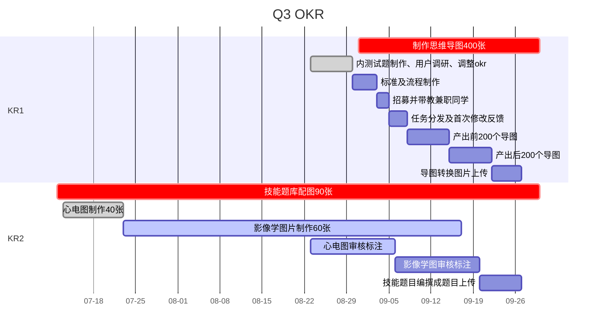

```mermaid

gantt
    dateFormat  YYYY-MM-DD
    axisFormat  %m-%d
    todayMarker on
    todayMarker stroke-width:3px,stroke:#0f0,opacity:0.5

    title       Q3 OKR
    %%excludes    weekends
    %% (`excludes` accepts specific dates in YYYY-MM-DD format, days of the week ("sunday") or "weekends", but not the word "weekdays".)

    section KR1
        制作思维导图400张           : crit,2021-08-31,2021-09-30
        内测试题制作、用户调研、调整okr : done,2021-08-23,1w
        标准及流程制作 : 4d
        招募并带教兼职同学: 2d
        任务分发及首次修改反馈:3d
        产出前200个导图:1w
        产出后200个导图:1w
        导图转换图片上传:5d


    section KR2 
        技能题库配图90张           :crit,2021-07-12,2021-09-30
        心电图制作40张             :done,2021-07-13,10d
        影像学图片制作60张          :active,8w
        心电图审核标注              :active,2021-08-23,2w
        影像学图审核标注            :2w
        技能题目编撰成题目上传       :1w


 


    

```