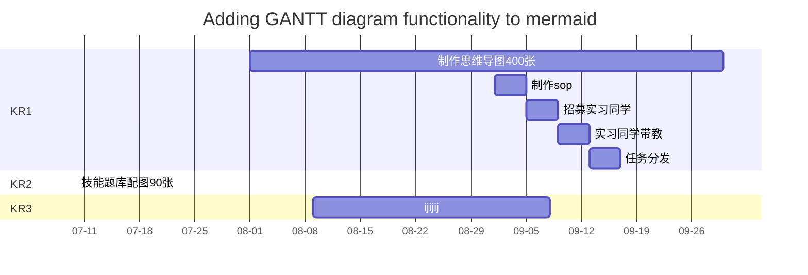

```mermaid

gantt
    dateFormat  YYYY-MM-DD
    axisFormat  %m-%d
    todayMarker on
    todayMarker stroke-width:3px,stroke:#0f0,opacity:0.5

    title       Adding GANTT diagram functionality to mermaid
    %%excludes    weekends
    %% (`excludes` accepts specific dates in YYYY-MM-DD format, days of the week ("sunday") or "weekends", but not the word "weekdays".)

    section KR1
    制作思维导图400张            : 2021-08-01,2021-09-30
    制作sop : 2021-09-01,4d
    招募实习同学: 4d
    实习同学带教:4d
    任务分发:4d

    section KR2

    技能题库配图90张 :active,2021-07-10,2021-09-31


    section KR3
    ijijij : 2021-08-09,30d
    

```